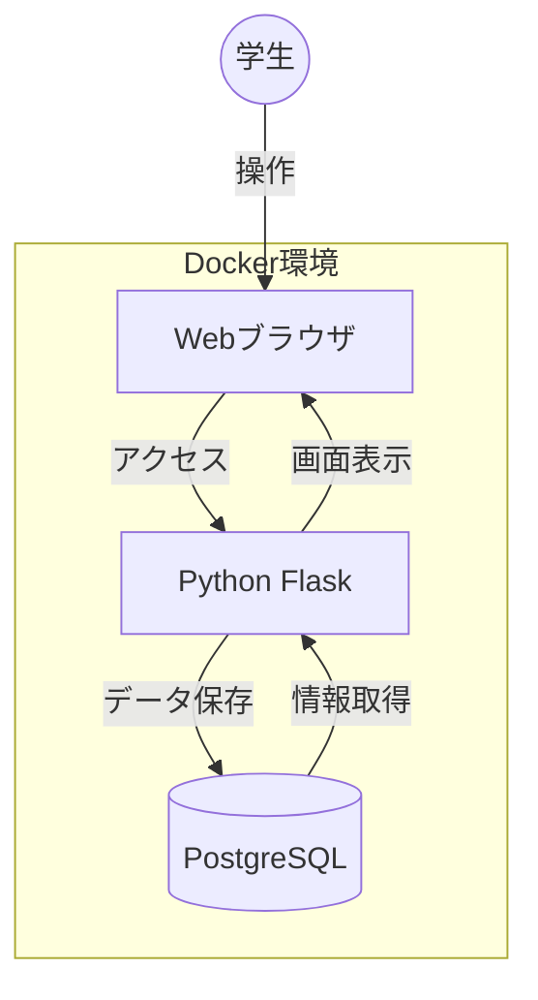

# 🎓 学生管理アプリ

このアプリは、学生の日常的な課題管理と授業の出席回数記録を一つの画面で行える、Flask（Python）ベースのWebアプリケーションです。

### システム構成図



## 🌟 主な機能

* **課題・出席の一元管理**: 授業ごとの出席回数と課題内容をサイドバーで素早く確認。
* **カレンダー連携**: FullCalendarを使用し、締切日を月間カレンダー上で視覚的に把握。
* **動的なステータス表示**: 締切間近は赤（Urgent）、期限切れはグレーアウトして表示。
* **Docker対応**: PostgreSQLを含む環境構築がコマンド一つで完了。

## 🛠 使用技術（Tech Stack）

* **Backend**: Python 3.11 / Flask / SQLAlchemy
* **Frontend**: HTML5 / CSS3 / JavaScript (FullCalendar v6)
* **Database**: PostgreSQL 15
* **Infrastructure**: Docker / Docker Compose

## 🚀 実行方法

1.Docker Desktopを起動します

2.リポジトリをクローンした後、以下のコマンドで起動します。

```bash
cd student-app
docker compose up -d --build

```

起動後、ブラウザで `http://localhost:3000` にアクセスしてください。

## 📂 成果物（Submission Items）

* **実装コード**: `/student-app` 
* **デモ動画**: `demo_video.mp4` 
* **プレゼンテーション資料**: `学生管理アプリ.pdf` 

## 📝 技術的な工夫

1. **コンテナオーケストレーションの最適化**:
`depends_on` と `healthcheck` を設定し、データベースが完全に起動してからアプリケーションが接続を開始するように制御。起動時のエラーを防止しています。
2. **データの永続化（Data Persistence）**:
Dockerの `volumes` 設定により、コンテナを再起動してもデータが消えない構成にしています。
3. **UI/UXの設計**:
締切時刻を比較して、自動的に表示スタイルを切り替える機能を実装しました。

graph LR
    subgraph Docker_Compose
        Web[Python Flask Container] <--> |Internal Network| DB[(PostgreSQL Container)]
        DB <--> Volume[(Docker Volume: Data Persistence)]
    end
    User((学生)) <--> |Browser / Port 3000| Web
